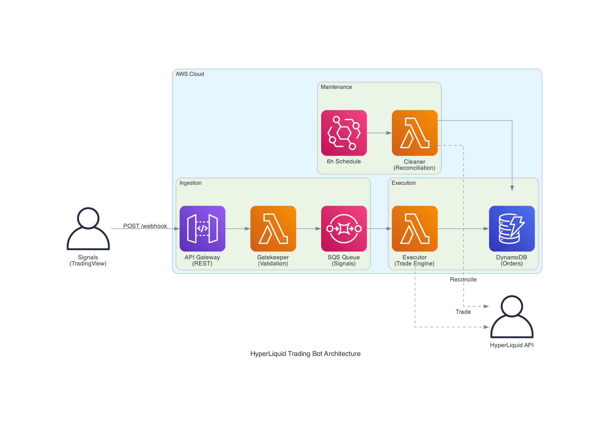

# HyperLiquid Trading Bot (AWS Migration)

High-performance, low-latency trading bot migrated from Azure Functions to **AWS Lambda (Serverless)**. This repository contains the full source code for the bot and the Terraform configuration for the AWS infrastructure.

## 🏗️ System Architecture



### **Key Components**
- **Gatekeeper (HTTP Lambda)**: Ingests signals from TradingView via API Gateway. Validates payloads in **<200ms** and offloads to SQS.
- **Executor (SQS Lambda)**: Processes signals asynchronously. Implements sizing logic, fetches market mids, and executes trades via HyperLiquid SDK.
- **Cleaner (EventBridge Lambda)**: Runs every 6 hours to reconcile database records with actual exchange positions.
- **DynamoDB**: On-demand storage for order tracking and audit logs.
- **SQS**: Decouples signal ingestion from trade execution for maximum reliability.

---

## 🚀 Quick Start

### **1. Build and Deploy**
All infrastructure and code deployment is managed from the `terraform/` directory.

```bash
cd terraform
terraform init
terraform apply
```

**This command will:**
1.  **Package** the Python functions and dependencies (Layers).
2.  **Zip** the functions for AWS Lambda.
3.  **Deploy** all resources (SQS, DynamoDB, API Gateway) to AWS.

### **2. Infrastructure Management**
- `make plan`: Preview changes.
- `make build`: Only update code bundles.
- `make init`: Re-initialize backend (S3).

---

## 🛠️ Project Structure
- **/src/hyperliquid_python**: Python source code using official SDK.
  - `/functions`: Lambda handlers (Gatekeeper, Executor, Cleaner).
  - `/services`: Core trade execution and validation logic.
  - `/repositories`: DynamoDB connectivity.
  - `/models`: Pydantic data models for webhooks and orders.
  - `/helpers`: HyperLiquid SDK initialization and common utilities.
- **/terraform**: AWS Infrastructure as Code (IaC).
- **/test**: Python-based test scripts for local simulation.

---

## 🧪 Testing
Test your setup using the provided Python scripts:
```bash
# Test Gatekeeper (Signal Ingestion) - Unit Test
python3 test/test_gatekeeper.py

# Test Executor (Trade Logic) - Unit Test
python3 test/test_executor.py

# Send real-to-AWS mock signal (Integration Test)
cd terraform && make test-signal
```

## 🔐 Security
- **IP Whitelisting**: API Gateway is restricted to TradingView's official IP ranges via Resource Policy.
- **IAM**: Least-privilege roles for all Lambda functions.
