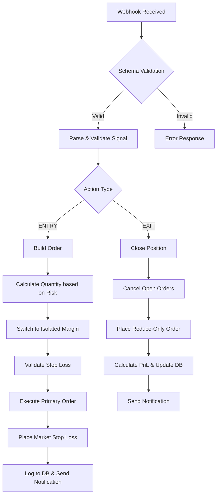

# HyperLiquid Trading Strategy & Logic

This document outlines the trading strategy, risk management, and order placement logic implemented in the HyperLiquid Azure Function.

## 1. High-Level Flow

The system processes incoming webhooks (typically from TradingView) and executes trades on the HyperLiquid exchange.



---

## 2. Trading Strategy: Risk-Based Sizing

The bot implements a **Fixed USD Risk** strategy. Instead of a fixed position size, the size is dynamic based on the distance between the entry price and the stop loss.

### Quantity Calculation
The quantity is calculated using the following logic in `buildOrder.ts`:
```typescript
const fixedUsdAmount = parseFloat(process.env.FIX_STOPLOSS || "5");
const rawSize = fixedUsdAmount / Math.abs(marketPrice - stopLossPrice);
const normalizedQuantity = normalizeOrderSize(symbol, rawSize, szDecimals);
```
*   **Target Risk**: Defined by `FIX_STOPLOSS` (default $5).
*   **Automatic Scaling**: If the stop loss is tight (close to entry), the quantity increases. If the stop loss is wide, the quantity decreases.
*   **Goal**: Ensure that if the stop loss is hit, the loss is always approximately the `FIX_STOPLOSS` amount.

---

## 3. Risk Management & Safety

### Isolated Margin Enforcement
The bot automatically checks the current margin mode for the asset. If it is set to "Cross", it sends a request to switch the asset to **Isolated Margin** before placing any orders. This prevents a single trade from affecting the entire account balance.

### Stop Loss Validation
Before execution, the bot calculates the estimated liquidation price:
*   **Buy Order**: Liquidation occurs if price falls below `Entry - (Margin / Size)`.
*   **Sell Order**: Liquidation occurs if price rises above `Entry + (Margin / Size)`.
The bot **rejects** the trade if the provided Stop Loss is further than the Liquidation Price, ensuring the stop loss triggers before liquidation.

### Precision Handling
Using the HyperLiquid SDK's `formatPrice` and asset `szDecimals`, the bot ensures all quantities and prices are rounded correctly to the exchange's required decimal places, preventing "Invalid Size" or "Invalid Price" errors.

---

## 4. Order Execution Workflow

### Entry Phase (`executeOrder`)
1.  **Primary Order**: A `Limit GTC` order is placed at the specified price.
2.  **Stop Loss**: A `Market Trigger` stop loss is immediately placed.
    *   Type: `sl` (Stop Loss)
    *   Trigger: Market Price
    *   Quantity: Same as the primary order.
3.  **Persistence**: The order ID and its associated stop loss ID are saved to Azure Table Storage for tracking.

### Exit Phase (`closeOrder`)
1.  **Position Lookup**: The bot identifies the active position and its original entry ID from the database.
2.  **Cleanup**: It cancels **all existing open orders** for that symbol (including the old stop loss) to prevent overlapping triggers.
3.  **Reduce-Only Exit**: It places a `Reduce-Only` limit order to close the position. This ensures the bot never accidentally opens a new position if the old one was already closed manually.
4.  **PnL Calculation**: After closing, the bot calculates the final realized PnL and updates the trade status to `closed` in the database.

---

## 5. Notifications
Every successful entry and exit triggers a Telegram notification including:
*   Symbol and Direction
*   Execution Price
*   Stop Loss Price
*   Total Position Value (Entry) or Realized PnL (Exit)

---

## 6. Automatic Reconciliation

To handle cases where a trade is closed on the exchange (e.g., via Stop Loss) without a webhook signal, a background job (`reconcileTrades`) runs every **6 hours**.

*   **Logic**: It compares all "open" trades in the database against the actual list of open orders on HyperLiquid.
*   **Trigger**: If both the `oid` (entry) and `stopLossOid` (protection) are no longer present in the local exchange's order book, the database record is automatically marked as `closed`.
*   **Benefit**: This maintains database integrity and prevents the bot from attempting to "double-close" positions that are already settled.
